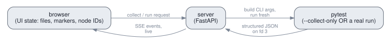

# Architecture

The one core idea: **collect, reload, and run are all the same operation.**
pytest-deck takes what you've selected in the browser, builds a pytest
command line from it, and spawns a fresh `python -m pytest` subprocess. Whether
that subprocess only collects the suite or actually runs your tests, the flow is
the same. Results come back on a dedicated channel as JSON, and the server
forwards them to the browser over one persistent stream.

## Data flow, end to end

Every action in the dashboard follows the same seven steps:

1. You select tests in the browser (checkboxes, marker chips, `-k`/`-m`).
2. The browser sends that selection to the server.
3. The server turns the selection into a pytest command line.
4. It spawns a fresh `python -m pytest` subprocess to run it.
5. The subprocess streams structured results back to the server as JSON, one
   object per line, on a channel separate from the console output.
6. The server relays each result to the browser as it arrives.
7. The browser folds the results into live PASS/FAIL/ERROR/SKIP badges.

Collecting the tree, reloading after an edit, and running a selection are all
this same path. Only the command line differs.

## The subprocess model

pytest-deck never runs your tests inside its own server process. Every collect
and every run happens in a brand-new interpreter, spawned just for that action
and thrown away when it finishes. The dashboard process only ever builds command
lines, reads results, and serves the browser.

This is the decision the whole tool rests on, and it has real consequences for
reload fidelity and crash isolation. Those are covered under
[Fresh subprocess, never in-process](fresh-subprocess).

## Collection and the test tree

To build the tree, pytest-deck runs a `--collect-only` subprocess and reads back
the collected items. It arranges them into the foldable **file, class, test,
variant** tree you see, where each parametrized case is its own leaf.

If one test file can't be imported, pytest-deck still shows you everything it
managed to collect from the other files, plus the specific import error for the
broken file. This is the same partial view pytest gives you: the good tests are
listed, and the failing file is reported as a collection error rather than
silently hiding the rest of your suite.

## Running and streaming results

Starting a run is a two-part exchange. The browser posts its selection, and the
server answers right away with a run identifier, then does the actual work in the
background. It does not hold the request open for the length of the run.

Results flow over a single persistent stream (Server-Sent Events) that the
browser opens once when the page loads. Each test's result is pushed as it
finishes, tagged with the run it belongs to. Every run ends with exactly one
terminal event, so the browser always knows when a run is truly done.

## The results channel

The subprocess reports its structured results on a dedicated file descriptor,
separate from stdout and stderr. Each line is one JSON object describing a phase
report, a warning, or a lifecycle event. pytest-deck never parses the console or
the terminal output to figure out what happened; the console is shown to you
as-is, and the machine-readable results ride their own channel.

Why a separate channel rather than stdout is covered under
[A dedicated results channel](design-invariants.md).

## Next steps

- [Design invariants](design-invariants.md): the reasoning behind the subprocess
  model, the two-plugin split, the results channel, and how pytest-deck stays
  faithful to a real pytest run.
- [Frontend](frontend.md): the browser half, from the single stream to live
  outcome folding.
